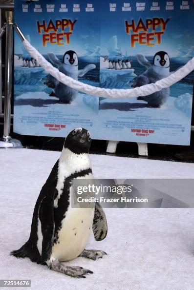
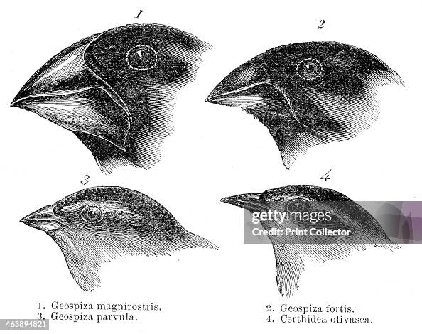

```{r}
#| label: load-packages
#| include: false

# Load packages here
#pacman::p_load(tidymodels,
 #              tidyverse)

library(tidyverse)
library(palmerpenguins)

```

```{r}
#| label: setup
#| include: true

#pipe data for what we want 
df_q1 <- penguins %>%
  drop_na(body_mass_g, flipper_length_mm, species)

#build the visualization
ggplot(df_q1, aes(x = body_mass_g, y = flipper_length_mm, color = species, shape = species)) +
  #scatterplot points with some transparency (alpha) so overlapping points are visible
  geom_point(size = 3, alpha = 0.8) +
  #dashed trendline for each species to highlight the scaling relationship
  geom_smooth(method = "lm", se = FALSE, linetype = "dashed") +
  # Use a colorblind-friendly, distinct color palette
  scale_color_manual(values = c("Adelie" = "darkorange", "Chinstrap" = "purple", "Gentoo" = "cyan4")) +
  # Add professional, descriptive labels
  labs(
    title = "Morphological Scaling by Penguin Species",
    subtitle = "Comparing body mass to flipper length across Adelie, Chinstrap, and Gentoo penguins",
    x = "Body Mass (grams)",
    y = "Flipper Length (mm)",
    color = "Species",
    shape = "Species"
  ) +
  #clean, modern theme
  theme_minimal() +
  theme(
    plot.title = element_text(face = "bold", size = 14),
    legend.position = "bottom"
  )

# Plot theme
ggplot2::theme_set(ggplot2::theme_minimal(base_size = 11))

# For better figure resolution
knitr::opts_chunk$set(
  fig.retina = 3, 
  dpi = 300, 
  fig.width = 6, 
  fig.asp = 0.618 
  )

```

```{r}
#| label: load-data
#| include: true
# Load data here


# 1. Prepare data for Q2
# We specifically drop rows where sex (or our numerical variables) is missing 
# to ensure a clean visual comparison of sexual dimorphism.
df_q2 <- penguins %>%
  drop_na(bill_length_mm, bill_depth_mm, sex, island)

# 2. Build the visualization
ggplot(df_q2, aes(x = bill_length_mm, y = bill_depth_mm, color = sex)) +
  # Add scatterplot points with transparency to handle overlapping
  geom_point(size = 3, alpha = 0.7) +
  # Facet the plot by island to create side-by-side comparative panels
  facet_wrap(~ island) +
  # Use a distinct, colorblind-friendly palette for biological sex
  scale_color_manual(values = c("female" = "#D95F02", "male" = "#1B9E77")) +
  # Add professional, descriptive labels
  labs(
    title = "Penguin Bill Proportions by Sex and Island",
    subtitle = "Comparing bill length vs. depth across the Palmer Archipelago",
    x = "Bill Length (mm)",
    y = "Bill Depth (mm)",
    color = "Sex"
  ) +
  # Customize specific theme elements (base minimal theme is applied globally)
  theme(
    plot.title = element_text(face = "bold", size = 14),
    legend.position = "bottom",
    # Make the facet labels (the island names) bold so they stand out
    strip.text = element_text(face = "bold", size = 12) 
  )

```


## Motivation: Why Palmer Penguins? {.smaller}


### The Inspiration

- **Pop Culture Spark:** A personal fondness for the film *Happy Feet* initially drew me to studying penguin demographics.

- **Scientific Curiosity:** Inspired by Charles Darwin’s landmark studies on finch beak adaptation, I wanted to explore how evolutionary traits manifest in penguin bill dimensions.

::: columns
::: {.column width="50%"}
{width="55%" fig-align="left"}

::: {.small-text style="font-size: 0.5em; color: gray; margin-top: 5px; text-align: left;"}

:::
:::

::: {.column width="50%"}
{width="85%" fig-align="right"}

::: {.small-text style="font-size: 0.5em; color: gray; margin-top: 5px; text-align: right;"}

:::
:::
:::


## The Dataset {.smaller} 

::: columns
::: {.column width="45%"}
### Dimensions & Scale


- **344** Total Observations 
  

- **8** Unique Variables 


- **3** Target Species
  *(Adelie, Chinstrap, and Gentoo)*

- **3** Study Islands 
  *(Biscoe, Dream, and Torgersen)*
  
- penguins and penguins_raw datasets included, penguins.csv was utilized

:::

::: {.column width="10%"}
:::

::: {.column width="45%"}
### Key Variables of Interest

The following attributes are isolated to answer the core research questions:

* **Morphological Metrics (Numerical):** `body_mass_g`, `flipper_length_mm`, `bill_length_mm`, and `bill_depth_mm`

* **Ecological Groupings (Categorical):** `species`, `sex`, and `island`
:::
:::

## Question 1: Interspecies Scaling {.smaller}

**The Question:** How does the relationship between a penguin's body mass and flipper length differ across the three distinct species?

::: columns
::: {.column width="50%"}
### Analytical Goal
We seek to determine if the physical scaling of body mass vs. limb length is consistent across the genus, or if specific species exhibit unique growth trajectories.
:::

::: {.column width="50%"}
### Variables Used
*   **Numerical Attributes:**
    - `body_mass_g` (Independent / X-axis)
    - `flipper_length_mm` (Dependent / Y-axis)

*   **Categorical Attribute:**
    - `species` (Grouping / Color & Shape)
:::
:::

## Question 2: Geography & Dimorphism {.smaller}

**The Question:** What is the distribution of bill depths across the three islands, and does this change depending on the sex of the penguin?

::: columns
::: {.column width="50%"}
### Analytical Goal
This multivariable approach evaluates "Sexual Dimorphism" (size differences between sexes) and whether these physical traits are influenced by the regional island environment.
:::

::: {.column width="50%"}
### Variables Used
*   **Numerical Attributes:**
    - `bill_depth_mm` (Primary Metric / Y-axis)
    - `bill_length_mm` (Contextual Metric / X-axis)

*   **Categorical Attributes:**
    - `island` (Geographic Grouping / Facets)
    - `sex` (Biological Grouping / Color)
:::
:::


## Visualizations

## Conclusions 

# Using Quarto for presentations

## Quarto

- The presentation is created using the Quarto CLI

- `##` sets the start of a new slide

## Layouts

You can use plain text

::::: columns
::: {.column width="40%"}
- or bullet points[^1]
:::

::: {.column width="60%"}
or in two columns
:::
:::::

[^1]: And add footnotes

- like

- this

## Code

```{r, echo=FALSE}
#model <- lm(mpg ~ speed, data = mtcars) 

#model |> tidy()

#model |> glance()

```

## Plots

```{r}
penguins |>
  mutate(species = ifelse(species == "Adelie", "Adelie", "Other")) |>
  ggplot(aes(x = flipper_length_mm, y = body_mass_g, color = species)) +
  geom_point()
```

## Plot and text

::::: columns
::: {.column width="50%"}
- Some text

- goes here
:::

::: {.column width="50%"}
```{r, warning=FALSE, fig.width=5.5}
penguins |>
  ggplot(aes(x = bill_length_mm, y = species, color = species)) +
  geom_boxplot(linewidth = 0.75,
               outlier.size = 2.5) +
  theme_minimal(base_size = 15) +
  theme(legend.key.size = unit(0.8, "cm"))
```
:::
:::::

# A new section...

## Tables

If you want to generate a table, make sure it is in the HTML format (instead of Markdown or other formats), e.g.,

```{r}
penguins |> 
  head() |>
  kableExtra::kable() |>
  kableExtra::kable_styling()
```

## Images

{fig-align="center" width="500"}

## Math Expressions {.smaller}

You can write LaTeX math expressions inside a pair of dollar signs, e.g. \$\\alpha+\\beta\$ renders $\alpha + \beta$. You can use the display style with double dollar signs:

```         
$$\bar{X}=\frac{1}{n}\sum_{i=1}^nX_i$$
```

$$\bar{X}=\frac{1}{n}\sum_{i=1}^nX_i$$

Limitations:

1.  The source code of a LaTeX math expression must be in one line, unless it is inside a pair of double dollar signs, in which case the starting `$$` must appear in the very beginning of a line, followed immediately by a non-space character, and the ending `$$` must be at the end of a line, led by a non-space character;

2.  There should not be spaces after the opening `$` or before the closing `$`.

# Wrap up

## Feeling adventurous?

- You are welcomed to use the default styling of the slides. In fact, that's what I expect majority of you will do. You will differentiate yourself with the content of your presentation.

- But some of you might want to play around with slide styling. Some solutions for this can be found at https://quarto.org/docs/presentations/revealjs.
